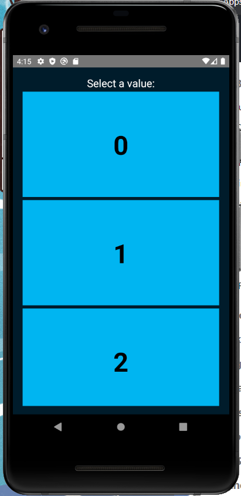

<style>
section .two-colums {
    overflow: visible;
    display: grid;
    grid-template-columns: 500px 500px;
    grid-template-rows: 100px auto;
    grid-template-areas: 
        "slideheading slideheading"
        "leftpanel rightpanel";
}

section .columns {
    text-align: center;
    overflow: visible;
    display: flex;
    align-items: center;
}

section .colum {
  margin: 16px;
  flex: 1;
}

section .alert {
  margin-top: .5rem;
  background-color: #d6d8d9;
  border: 1px solid #c6c8ca;
  border-radius: .25rem;
  padding: .75rem 1.25rem;
}
</style>


# **React Native Introduction**

First steps into React Native development

---

# Before we start

I hope, all the people interested in doing the exercises, have followed the steps of the `Install React Native dependencies` guide. 

If you want to do the exercises but don't have the dependencies you can try to install `Expo` to follow the exercises.

[Install guide](https://gist.github.com/ismanapa/52ccd39516a47d9136e882f2becfef6d)

[Expo guide](https://reactnative.dev/docs/environment-setup)

---

# Before we start

Please, clone the repo with the exercises

```
https://github.com/ismanapa/react-native-intro
```

Also, make npm install in the `MyExampleApp` directory

```
cd MyExampleApp && npm install
```

---

# Objetives of the workshop

- A brief introduction to React Native.
- How works React Native.
- How to create a project
- Make your first little app

---

# Introduction: kinds of mobile apps

<div class="columns" style="height: 80%;">
  <div class="colum">

  #### Native
  platform specific
  good performance
  a project per platform

  </div>
  <div class="colum">

  #### Web apps
  HTML apps adapted to mobile
  PWA

  </div>
  <div class="colum">

  #### Hybrid
  App made in web technologies but wrapped in a native app

  </div>
</div>

---

# What is React Native

A framework for building native apps using React. In short, a kind of react renderer which targets mobile apps, iOS and Android.

<div class="columns" style="text-align: center;">
  <div class="colum" style="margin: 0;">

  

  </div>
</div>

There are also other renderes:

```
react-canvas react-blessed react-vr react-pdf react-fs-renderer
```
---

# How is a React Native component?

In `react-dom` we use the building blocks from the web (div,span,table) and `react-native` use his own building blocks. 

<div class="columns" style="text-align: center;">
  <div class="colum" style="margin: 0;">

  

  </div>
</div>

---

# Lots of building blocks

<div class="columns" >
  <div class="colum">
  
  SafeAreaView
  StatusBar
  ScrollView
  Switch
  TextInput
  RefreshControl
  </div>
  <div class="colum">

  Text
  Button
  View
  Image
  ImageBackground
  Pressable
  </div>
</div>

<div class="alert">
Every core component have traduction to a native component
</div>

---

# Lots of apis

[react-native-sensors](https://github.com/react-native-sensors/react-native-sensors) (accelerometer, gyroscope, magnetometer, barometer )

[react-native-device-info](https://github.com/react-native-device-info/react-native-device-info) (Id, OS, manufacturer, battery, etc...)

[react-native-maps](https://github.com/react-native-maps/react-native-maps)

[react-native-camera](https://github.com/react-native-camera/react-native-camera)

<div class="alert">
If there is no package, you can always develop a native module
</div>

---

# How works React Native?

Asynchronous bidirectional communication between Javascript and Native side via `bridge`.

<div class="columns" style="text-align: center;">
  <div class="colum" style="margin: 0;">

  
  </div>
</div>

---

# Bridge in a nutshell

In short, the bridge component is a message broker which interprets messages sent in json. 

<div class="columns" style="text-align: center;">
  <div class="colum" style="margin: 0;">

  
  </div>
</div>

---

# Bridge implementations

Every platform has its own implementation of the bridge on the native side.

<div class="columns" style="text-align: center;">
  <div class="colum" style="margin: 0;">

  
  </div>
</div>

<div class="columns" style="text-align: center;">
  <div class="colum" style="margin: 0;">

  
  </div>
</div>

---

# Other implementations

React Native can target other platforms because the agnostics nature of the bridge. For example we have: 

[React Native for Windows + macOS](https://microsoft.github.io/react-native-windows/)

[React Native web 🤯](https://github.com/necolas/react-native-web)

---
<!-- _class: lead -->


# This is very interesting.... but where is the code?

---

# How to start a project

ES6 version
```
npx react-native init AwesomeProject
```

Typescript version
```
npx react-native init AwesomeProject --template react-native-template-typescript
```

---

# Project anatomy

<div class="columns" style="text-align: center;">
  <div class="colum" style="margin: 0;">

  Android
  
  </div>

  <div class="colum" style="margin: 0;">

  iOS
  
  </div>
</div>

---
<!-- _class: lead -->


# Let's start the workshop

Does everybody have his environment ready?

Ready Steady Open Emulators!

Start project!

<div class="alert" style="text-align: center;">
npx react-native run-android
</div>

---

# Plain poker: an estimation tool

<div class="columns" style="text-align: center;">
  <div class="colum" style="margin: 0;">

  
  </div>

  <div class="colum" style="margin: 0;">

  
  </div>
</div>

---

# Example 1: Building blocks


<div class="columns" style="text-align: center;">
  <div class="colum" style="margin: 0;">

  
  </div>

  <div class="colum" style="margin: 0;">

  
  </div>
</div>

---

# Example 2: Styling components

<div class="columns" style="text-align: center;">
  <div class="colum" style="margin: 0;">

  
  </div>

  <div class="colum" style="margin: 0;">

  
  </div>
</div>

---


# Example 2: Styling components

<div class="columns" style="text-align: center;">
  <div class="colum" style="margin: 0;">

  This is our objective. Don't worry about the layout distribution. Feel fre to make other styles 😉

  <div class="alert">
  Buttons are special components and don't have style prop!
  </div>

  
  </div>

  <div class="colum" style="margin: 0;">

  
  </div>
</div>

---

# Example 3: App layout

<div class="columns" style="text-align: center;">
  <div class="colum" style="margin: 0;">

  React Native lives in the flexbox realm. This is the display for all containers.

  
  </div>

  <div class="colum" style="margin: 0;">

  
  </div>
</div>

---

# Example 4: Navigation

In web development, we have the `history navigator` where we have a history of visited pages.

<div class="columns" style="text-align: center;">
  <div class="colum" style="margin: 0;">

  In mobile development, navigation follows other patterns. In our example, we are going to use a stack navigator. But there are other navigators like `drawer`.
  </div>

  <div class="colum" style="margin: 0;">

  
  </div>
</div>

---

# Example 4: Navigation

Create a new stack navigator in the App component and also a new Page component.

<div class="columns" style="text-align: center;">
  <div class="colum" style="margin: 0;">
  
  
  </div>

  <div class="colum" style="margin: 0;">

  
  </div>
</div>

---

# Example 5: Lists

<div class="columns" style="text-align: center;">
  <div class="colum" style="margin: 0;">
  
  React Native has also components to make a list of items with scroll. For example, `FlatList` is a good element to make a long list of data because is optimized to only renders elements that are currently showing on the screen.
  </div>

  <div class="colum" style="margin: 0;">

  
  </div>
</div>

---

# Example 5: Lists

<div class="columns" style="text-align: center;">
  <div class="colum" style="margin: 0;">
  
  
  </div>

  <div class="colum" style="margin: 0;">

  
  </div>
</div>

---

# Example 6: Finishing the app

In the last exercise, everyone is going to finish the app on their own.

The objective is to press over a value a show it to your partners in the estimation. 

Later is will show my final solution (very simple)

---

# Bonus track: Building your app

To test the app like a real application we have to build the final bundle and install it on a real device. 

In the repository, there is a Github Action pipeline with the steps to build our app and publish it to AppCenter.

Later, with the AppCenter app, we can install the application on a real device and tests it.

Let's check the process!

---

<!-- _class: lead -->

# **Thanks!!**